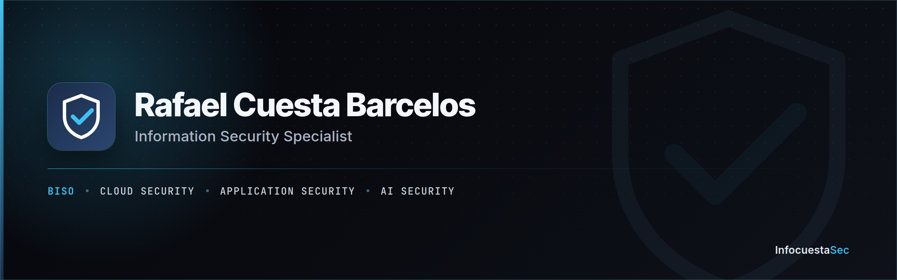

  

I work across cloud security, application security, AI security, and GRC — from architecture and hardening to vulnerability management and threat intelligence.

## Featured

- **[srx210-linux](https://github.com/rafabarcelos/srx210-linux)** — Linux 5.4 standalone on a Juniper SRX210 (Cavium Octeon CN5020, MIPS64), booting from a USB drive without touching JunOS.
- **[esp32-sectool-micropython](https://github.com/rafabarcelos/esp32-sectool-micropython)** — ESP32 running MicroPython: a Wi-Fi + BLE reconnaissance dashboard for the local network, with remote WebREPL.
